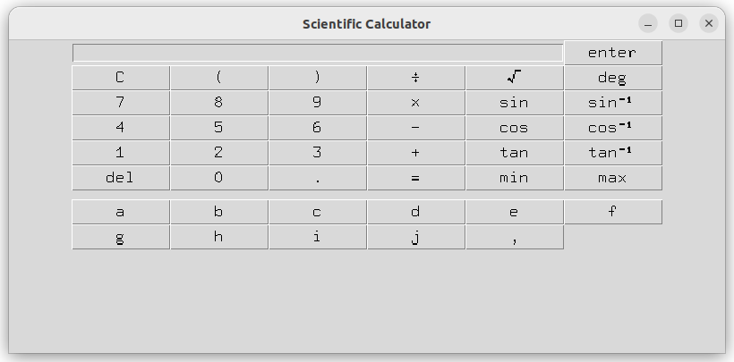

# Käyttöohje

Lataa projektin ZIP-tiedosto tai käytä komentoa 

```
git clone https://github.com/uyenmh/sci-calc.git
```

terminaalissa.

## Riippuvuuksien asentaminen

Asenna riippuvuudet komennolla

```
poetry install
```

## Sovelluksen käynnistäminen

Sovellus voidaan käynnistää komennolla

```
poetry run invoke start
```

## Sovelluksen käynnistäminen virtuaaliympäristössä

Vaihtoehtoisesti sovellus voidaan käynnistää virtuaaliympäristössä ensin käynnistämällä virtuaaliympäristö komennolla

```
poetry shell
```

ja seuraavaksi komennolla

```
invoke start
```

## Laskimen toiminta

Laskin toimii niin, että käyttäjä painaa hiirellä laskimen näppäimiä. Laskin tukee peruslaskutoimituksia, useita funktioita ja muuttujien tallennusta. Enter-näppäin suorittaa laskutoimituksen ja antaa tuloksen syötekenttään, jos syöte on validi. Jos syöte on virheellinen, laskin ilmoittaa virheestä. Joissain tapauksissa laskin ilmoittaa virheestä, kun käyttäjä yrittää syöttää uuden merkin laskimeen.

Sovelluksen käynnistäminen avaa tällaisen näkymän



### Kokonaisluvut ja desimaalit

Laskin hyväksyy syötteeksi sekä kokonais- että desimaalilukuja. "."-näppäin toimii desimaalierottimena.

### Muuttujat

Muuttujiin *a-j* voidaan tallentaa lukuarvoja myöhempää käyttöä varten. Tallennus tapahtuu niin, että muuttuja sijoitetaan joko ennen tallennettavaa arvoa tai sen jälkeen. Laskutoimituksen tuloksia voidaan myös tallentaa suoraan muuttujiin.

Esimerkkejä:

$a=5$

$a=5-2+6$

$5=b$

$5-4-6=b$

Kun muuttujaan on tallennettu arvo, sitä voidaan käyttää normaalisti laskutoimituksissa. Esim. jos $a=3$, niin $a+1$ antaa tulokseksi $4$.

Muuttujille voidaan asettaa myös toisen muuttujan arvo. Tarkastellaan esim. laskutoimitusta $a=b$. 
- Jos $a=9$ ja $b$:llä ei ole vielä arvoa, $b=9$ ja $a$ pysyy samana.
- Jos $a$:lla ei ole vielä arvoa ja $b=1$, $a=1$ ja $b$ pysyy samana.
- Jos $a=2$ ja $b=0$, $a=0$ ja $b$ pysyy samana.

### Funktiot

- **√**: neliöjuuren sisälle voidaan syöttää sekä lukuarvoja että laskutoimituksia. Lukuarvojen ja laskutoimitusten tulosten pitää olla positiivisia, jotta laskin laskee neliöjuuren. Muuten laskin antaa käyttäjälle virheviestin virheellisestä syötteestä. Laskimeen voidaan syöttää esim. $\sqrt{(7)}$ tai $\sqrt{(7.6-4)}$.
- **sin, cos, tan**: trigonometriset funktiot voivat saada arvokseen sekä lukuarvoja että laskutoimituksia. Laskimeen voidaan syöttää esim. $sin(5)$ tai $tan(6.4-3)$. Trigonometriset funktiot toimivat sekä radiaaneissa että asteissa.
- **sin⁻¹, cos⁻¹, tan⁻¹**: käänteiset trigonometriset funktiot voivat saada arvokseen sekä lukuarvoja että laskutoimituksia. Lukuarvojen ja laskutoimitusten tulosten pitää olla välillä -1 ja 1, jotta laskin laskee arvon. Muuten laskin antaa käyttäjälle virheviestin virheellisestä syötteestä. Laskimeen voidaan syöttää esim. $cos⁻¹(0.638)$ tai $cos⁻¹(5-4)$.
- **min, max**: palauttavat pienimmän tai suurimman arvon kahden arvon väliltä. Nämä arvot erotetaan toisistaan pilkulla. Funktioihin voidaan asettaa sekä lukuarvoja että laskutoimituksia. Laskimeen voidaan syöttää esim. $min(3,9)$ tai $max(4-3+0.294,1-3)$.

### Muut näppäimet

- **=**: lisää yhtäsuuruusmerkin lausekkeeseen. Käytetään yhdessä muuttujien kanssa.
- **rad/deg**: näppäin vaihtaa tilaa radiaanien ja asteiden välillä. Laskimen oletusasetuksena on radiaani.
- **del**: näppäin poistaa viimeisimmän merkin tai funktion.
- **C**: näppäin tyhjentää syötekentän täysin.
- **enter**: laskee käyttäjän syöttämän syötteen.
