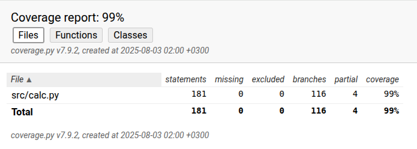

# Testausdokumentti

## Calculator-luokka

Applikaation yksikkötestaamiseen ollaan käytetty Pythonin unittest-moduulia. TestCalculator-luokan setUp()-metodi alustaa laskimen annetulla syötteellä. Osa testeistä käyttää annettua syötettä ja osa saa eri syötteen, mutta alustettua laskinta käytetään kaikissa testeissä.

### check_validity_of_input()

Metodia ollaan testattu niin, että jokaista virheviestiä varten on tehty oma testi. Jokainen testi tarkistaa metodin palauttaman viestin, kun annetaan virheellinen syöte. Testeissä hyödynnetään unittestin self.assertEqual-metodia.

Syötteet, joilla testaus tehtiin:
- kaksi peräkkäistä operaattoria
- tyhjät sulkeet
- kertomerkki vasemman sulun jälkeen
- jakomerkki vasemman sulun jälkeen
- oikea sulku operaattorin jälkeen
- kaksi peräkkäistä pistettä lukuarvossa
- kaksi ei-peräkkäistä pistettä lukuarvossa
- kertomerkki lausekkeen ensimmäisenä
- jakomerkki lausekkeen ensimmäisenä
- oikea sulku ennen vasenta sulkua
- oikea sulku lausekkeen ensimmäisenä

Metodissa olevia sulkujen laskureita ollaan myös testattu. 

### insert_input(user_input)

Metodia ollaan testattu niin, että ensin tarkistetaan, millaisia arvoja alussa annettu syöte antaa. Näitä arvoja ovat syöte itse, uudelleenmuotoiltu syöte, tokenit ja RPN-jono. Laskimelle annetaan seuraavaksi uusi syöte, jonka jälkeen tarkistetaan, että aikaisemmin annetut arvot ovat muuttuneet, miten niiden pitäisi. Testeissä hyödynnetään unittestin self.assertEqual-metodia.
	
### reformat_input()

Metodia ollaan testattu monipuolisilla syötteillä. Testeissä ollaan käytetty sekä kokonais- että desimaalilukuja. Testisyötteissä ollaan käytetty myös sulkeita, kaikkia operaattoreita ainakin kerran ja laskimessa olevia funktioita. Testit tarkistavat, että syöte uudelleenmuotoillaan oikein. Testeissä hyödynnetään unittestin self.assertEqual-metodia.

### tokenize_input()

Metodia ollaan testattu kokonaisluvuilla, desimaaliluvuilla ja funktioilla. Haluttu tokenisaatio ollaan kirjoitettu testiin manuaalisesti. Testissä hyödynnetään unittestin self.assertEqual-metodia.

### convert_infix_to_rpn()

Metodia ollaan testattu erilaisilla lukuarvoilla ja joillakin funktioilla. Haluttu RPN-muoto ollaan selvitetty manuaalisesti. Testissä hyödynnetään unittestin self.assertEqual-metodia.

### calculate()

Metodia ollaan testattu niin, että haluttu ratkaisu on laskettu pythonia hyödyntäen. Testit vertaavat saatua arvoa ja haluttua arvoa toisiinsa. Testeissä on käytetty kokonaislukuja, desimaalilukuja ja funktioita. Myös virheviestejä ollaan testattu. Testissä hyödynnetään unittestin self.assertEqual-metodia.

## Testien toisto

Testit voidaan suorittaa alla olevalla komennolla virtuaaliympäristössä:

`coverage run --branch -m pytest src; coverage html`

Komento generoi samalla testikattavuusraportin tiedostoon _index.html_, jota voidaan tarkastella selaimessa.

Testit voidaan suorittaa myös komennolla:

`coverage run --branch -m pytest src; coverage report -m`

Komento generoi tällöin testikattavuusraportin komentoriville.

## Testikattavuusraportti

